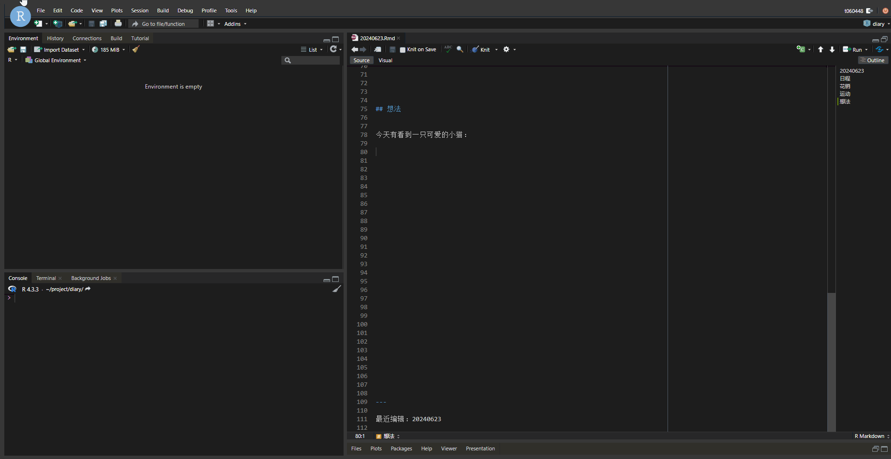
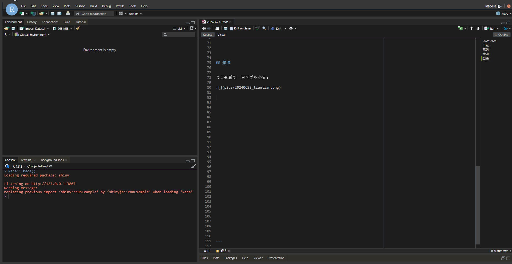
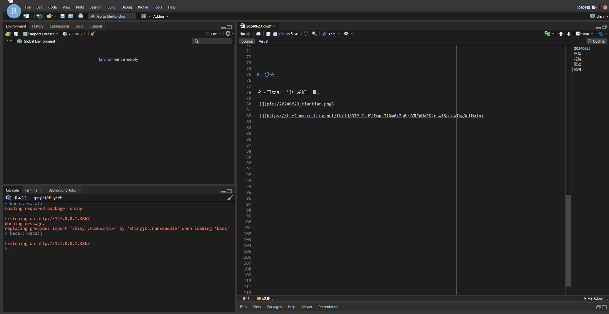

```{r, include = FALSE}
knitr::opts_chunk$set(
  collapse = TRUE,
  comment = "#>",
  out.width = "100%"
)
```

# kaca
 
In short, `kaca` is a shiny application which captures image or link, saves it to designated dir and inserts a url. For it is based on shiny and JavaScript, basically can be used on RStudio in any operating system (including RStudio Server).

## Usage

First, you need to set a shortcut key (if you don't want to run `kaca::kaca()` in the console every time), I highly recommend `Ctrl + Alt + C` or `Ctrl + B` (because these two are not commonly used by other softwares).You can search for `Insert pics from clipboard` in the `modify keyboard shortcuts` of RStudio to find `kaca`.

Then, assuming there is an image on your clipboard, that's great! You just need to press the shortcut key you set earlier to save the image and insert a quote. Remember to give your picture a meaningful name.

Because the method used here is image encoding and decoding to obtain and save images, it can't save animated images on the clipboard. This issue could be partially resolved by using the method of copying links below.

```{r fig.cap='Copy an image!'}

```

If there is an image link on your clipboard, you can either directly insert the original link or download it to your local device before inserting a new link. The latter option won't take much effort.

```{r fig.cap='Copy a link and insert raw.'}

```

Be sure to remember that any images saved locally need to have a meaningful name, unless you set `options('kacaMode' = 'auto')`. You can also set `options('kacaMode' = 'semi')` to revert back to the initial. But I believe this setting is generally not needed.

```{r fig.cap='Copy a link, download and insert it.'}

```

## Plan

Next, `kaca` will try to add support for image hosting services, allowing images or links on the clipboard to be uploaded directly to the specific image hosting service link.
