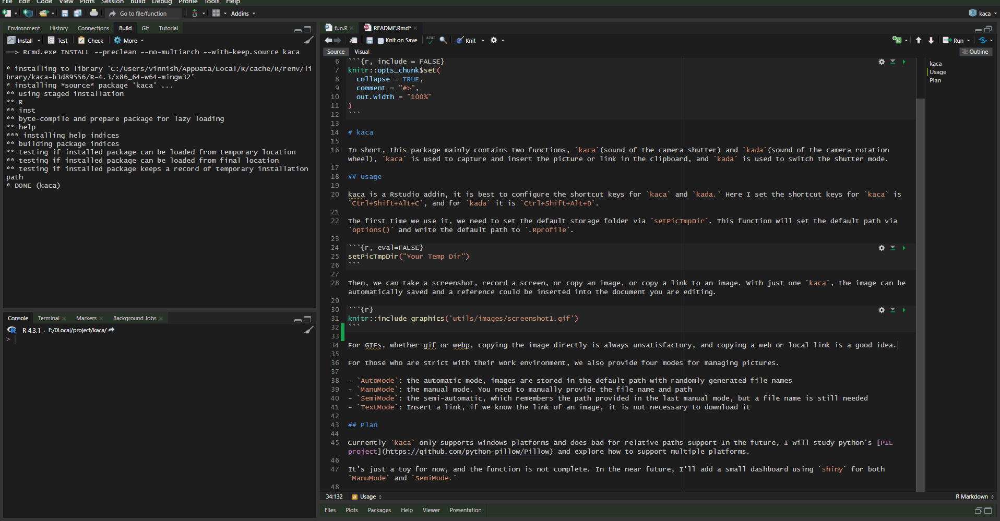

kaca: RStudio Addin to Insert Pictures and Links from clipborad
================

# kaca

In short, this package mainly contains two functions, `kaca`(sound of
the camera shutter) and `kada`(sound of the camera rotation wheel),
`kaca` is used to capture and insert the picture or link in the
clipboard, and `kada` is used to switch the shutter mode.

## Usage

kaca is a Rstudio addin, it is best to configure the shortcut keys for
`kaca` and `kada.` Here I set the shortcut keys for `kaca` is
`Ctrl+Shift+Alt+C`, and for `kada` it is `Ctrl+Shift+Alt+D`.

The first time we use it, we need to set the default storage folder via
`setPicTmpDir`. This function will set the default path via `options()`
and write the default path to `.Rprofile`.

``` r
setPicTmpDir("Your Temp Dir")
```

Then, we can take a screenshot, record a screen, or copy an image, or
copy a link to an image. With just one `kaca`, the image can be
automatically saved and a reference could be inserted into the document
you are editing.

``` r
knitr::include_graphics('utils/images/screenshot1.gif')
```


For GIFs, whether gif or webp, copying the image directly is always
unsatisfactory, and copying a web or local link is a good idea.

``` r

```


For those who are strict with their work environment, we also provide
four modes for managing pictures.

- `AutoMode`: the automatic mode, images are stored in the default path
  with randomly generated file names
- `ManuMode`: the manual mode. You need to manually provide the file
  name and path
- `SemiMode`: the semi-automatic, which remembers the path provided in
  the last manual mode, but a file name is still needed
- `TextMode`: Insert a link, if we know the link of an image, it is not
  necessary to download it

## Plan

Currently `kaca` only supports windows platforms and does bad for
relative paths support In the future, I will study python’s [PIL
project](https://github.com/python-pillow/Pillow) and explore how to
support multiple platforms.

It’s just a toy for now, and the function is not complete. In the near
future, I’ll add a small dashboard using `shiny` for more handy options
in both `ManuMode` and `SemiMode.`
