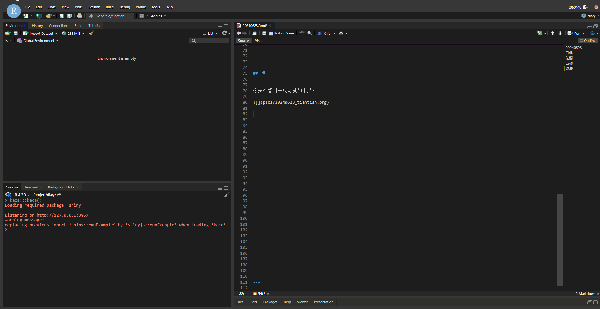
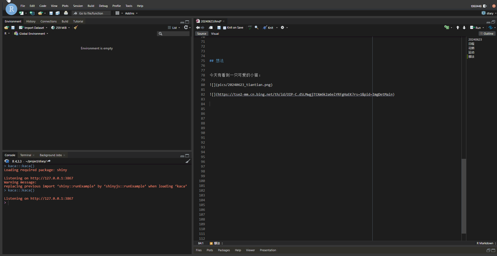

kaca: RStudio Addin to Insert Pictures and Links from clipborad
================

# kaca

In short, `kaca` is a shiny application which captures image or link,
saves it to designated dir and inserts a url. For it is based on shiny
and JavaScript, basically can be used on RStudio in any operating system
(including RStudio Server).

## Usage

First, you need to set a shortcut key (if you don’t want to run
`kaca::kaca()` in the console every time), I highly recommend
`Ctrl + Alt + C` or `Ctrl + B` (because these two are not commonly used
by other softwares).You can search for `Insert pics from clipboard` in
the `modify keyboard shortcuts` of RStudio to find `kaca`.

Then, assuming there is an image on your clipboard, that’s great! You
just need to press the shortcut key you set earlier to save the image
and insert a quote. Remember to give your picture a meaningful name.

Because the method used here is image encoding and decoding to obtain
and save images, it can’t save animated images on the clipboard. This
issue could be partially resolved by using the method of copying links
below.

``` r
knitr::include_graphics('utils/images/pre1.gif')
```

<div class="figure">


<p class="caption">
Copy an image!
</p>

</div>

If there is an image link on your clipboard, you can either directly
insert the original link or download it to your local device before
inserting a new link. The latter option won’t take much effort.

``` r

```

<div class="figure">


<p class="caption">
Copy a link and insert raw.
</p>

</div>

Be sure to remember that any images saved locally need to have a
meaningful name, unless you set `options('kacaMode' = 'auto')`. You can
also set `options('kacaMode' = 'semi')` to revert back to the initial.
But I believe this setting is generally not needed.

``` r

```

<div class="figure">


<p class="caption">
Copy a link, download and insert it.
</p>

</div>

## News!

Now we have image hosting service in R. including `github` and `gitee`!
You can use `Github Action` to reach other services for now.

Use
`edit_environ_github`/`edit_environ_gitee`/`edit_environ_githubAction`
to configure environs. Note that in `githubAction` we do nothing but to
replace the raw url to provided one, like:


In which, you should designate `HOST_SERVICE` as github or gitee.

The tutorial on connecting Github Action to Tencent Cloud can be found
[here](https://blog.csdn.net/Tencent_COS/article/details/102714201), and
I have conducted it, which is very convenient for writing Wexin
articles.

## Plan

Add built-in support for other image hosting service.
